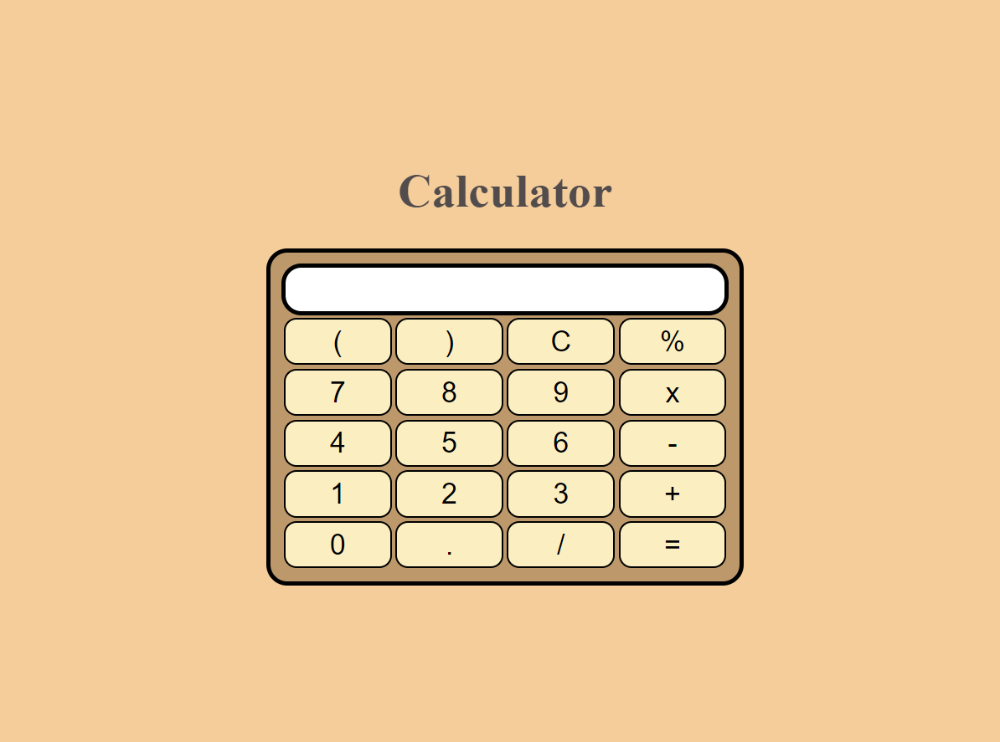

# Basic-Calculator
This calculator performs basic operations like addition, subtraction, multiplication, division and modulo division.

A preview to the Calculator :

[Link to the Calculator](https://avinash905.github.io/Basic-Calculator/)